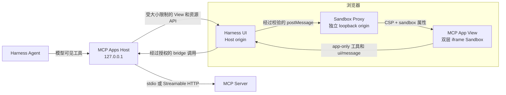

# DSH Uni Editor

[English](README.md) | 简体中文

[](https://github.com/creativedswork/dsh-uni-editor/actions/workflows/ci.yml)
[](https://www.npmjs.com/package/@creative-dswork/dsh-uni-editor)
[](https://github.com/creativedswork/dsh-uni-editor/releases)
[](LICENSE)

**所有 Editor，一个 DSH Editor。**

DSH Uni Editor 将现有 Editor 接入 DeepSeek Harness Agent Chat。Editor 保留自己的 UI、数据模型和领域工具；DSH 统一入口、当前 Session 上下文，以及人工编辑与 Agent 之间可验证的交接。

它是一个基于稳定版 MCP Apps 的 Cordis 插件包。一个 npm 包同时提供 Host 插件、Browser bundle，以及用于启用两者的 `dsh.bundle` patch。

Host 管理 MCP 连接，通过 Harness 注册模型可见工具，不把 app-only 工具暴露给模型，并通过不同源的 Sandbox Proxy 运行不受信任的 View。整个方案不需要修改 Agent Loop，也不需要外部 MCP 代理。

<a href="https://www.youtube.com/watch?v=KkvLgN2GeTI">
  
</a>

[观看视频演示](https://www.youtube.com/watch?v=KkvLgN2GeTI)，了解 [`threejs-editor-mcp`](https://github.com/creativedswork/threejs-editor-mcp) 如何直接运行在 DSH Chat UI 中。Editor 始终可以从 Session Header 返回；inline 与 fullscreen 切换不会重建 iframe，并可通过 **Locate in Chat** 返回产生该 App 的工具消息。

## 安装

将 npm 包安装到 Web profile：

```sh
dsh plugin --profile web add @creative-dswork/dsh-uni-editor
```

安装后 bundle 会自动启用。在 `$DSH_HOME/profiles/web/cordis.patch.yml` 中配置 `mcp-apps`：

```yaml
- id: mcp-apps
  config:
    servers:
      - serverName: counter
        transport: stdio
        command: node
        args: [/absolute/path/to/server.js]
        cwd: /absolute/path/to/server
        forwardWorkspace: true
    prompts:
      autoInject:
        - serverName: counter
          name: test-review-loop
          arguments:
            threshold: '85'
```

`forwardWorkspace` 默认关闭，只应对需要当前 DSH Workspace 的可信本地 stdio
Server 启用。`transport: streamable-http` 不会收到 Workspace metadata；此时改为
提供 `url` 和可选的 `headers`，不再填写 `command`、`args`、`cwd` 和 `env`。
`serverName` 必须匹配 `[A-Za-z0-9_-]{1,32}`，它会成为公开工具名的一部分。

`prompts.autoInject` 是显式信任白名单。Host 会对每个配置项调用 MCP
`prompts/list` 和 `prompts/get`，再将返回的指导内容加入 Harness system
prompt。这样 Agent 可以在普通 Turn 中主动采用 MCP 提供的工作流，不需要
Slash Command。当前只接受 user-role 文本和内嵌文本资源；Server 断开时会
移除对应 Prompt，收到 `notifications/prompts/list_changed` 后会重新加载。
不要将不可信 Server 的 Prompt 加入白名单，因为这些内容会获得 system
prompt 权限。

启动 Harness：

```sh
dsh web
```

Web profile 必须绑定到 `127.0.0.1`。当前 Sandbox Proxy 只支持 loopback 浏览器，因此插件会拒绝范围更大的监听地址。

## 独立 Counter Demo

仓库内置了一个本地 stdio MCP Server：

- `show_counter`：模型可见工具，关联 `ui://counter/app`；
- `increment_counter`：只有该 View 可以调用的 app-only 工具；
- 一个使用 MCP Apps 官方 `App` 的内置 View。

下面的命令使用已发布的 Harness CLI，不依赖相邻的 `deepseek-harness` 源码目录：

```sh
pnpm install
pnpm run build
export DSH_HOME="$PWD/.tmp/demo-home"
pnpm dlx @deepseek-ai/dsh@0.1.0-rc.6 plugin --profile web add "$PWD"
pnpm dlx @deepseek-ai/dsh@0.1.0-rc.6 web --patch "$PWD/demo/cordis.patch.yml"
```

打开命令输出的 URL，将当前目录连接为 workspace，然后让已配置的模型显示 counter。工具调用完成后，工具卡片会渲染数值 `0`；点击 `+` 时，View 会通过 Host 调用 app-only 的 `increment_counter`，并把数值更新为 `1`。

完整编辑器示例请参阅 [`threejs-editor-mcp`](https://github.com/creativedswork/threejs-editor-mcp)。

## 行为

- 目标规范为 MCP Apps `2026-01-26`，View MIME 类型为 `text/html;profile=mcp-app`。
- 支持 stdio 和 Streamable HTTP 两种 MCP transport。
- 只将明确加入白名单的 MCP Prompt 注入 Harness system prompt，并标注来源。
- 识别 `_meta.ui.visibility`；省略该字段时，工具同时对模型和 App 可见。
- 对设置 `forwardWorkspace: true` 的可信本地 stdio Server，将调用 Agent
  不可变的 Workspace `cwd` 写入模型发起的 `tools/call` request metadata
  `ai.deepseek.dsh/workspace`。远程 HTTP、App 发起的调用以及模型可见的 tool
  参数和结果都不包含该值。
- 将可读文本交给模型，同时把 `structuredContent` 和结果 `_meta` 保存在受大小限制、仅 UI 可见的 presentation metadata 中。
- 使用官方 `AppBridge` 和 `PostMessageTransport` 处理 View 生命周期，以及 App 发起的工具和资源调用。
- 在 Session Header 中提供持续可见的 Active App 入口，并支持多个 MCP App Instance。
- 打开 fullscreen 时不重建 iframe 或 `AppBridge`，保留 View 中尚未保存的状态。
- 通过 `Locate in Chat` 返回产生该 App 的原始工具消息。
- 代理 `ui/download-file`，允许下载一个最大 4 MiB 的内嵌 JSON 资源，因为 Sandbox View 无法直接下载文件。
- 在独立 loopback origin 上通过 HTTP header 强制执行 CSP，并校验 `postMessage` 的 source 和 origin。
- View 加载失败时回退到普通文本工具结果。

工具列表变化会自动同步；transport 自动重连尚未实现。Browser 每五秒刷新一次 catalog。

## 安全架构



- Host 和 Sandbox Proxy 使用不同的 loopback origin。
- View 运行在双层 iframe 中，由 HTTP CSP 和明确的 sandbox 属性共同约束。
- bridge 接受消息前会校验 `postMessage` 的 source 和 origin。
- 工具可见性将模型可见工具与 app-only 工具分开。
- Host API 拒绝跨源写入，并限制请求体和 metadata 的大小。

## 开发

```sh
pnpm install
pnpm run check
pnpm run pack:dry-run
```

将本地 checkout 安装到 profile：

```sh
dsh plugin --profile web add .
dsh --profile web --dump-config
```

## 发布

`prepack` 会执行类型检查、生产构建和包测试。npm tarball 包含 Host 入口、Browser bundle、类型声明、bundle patch、许可证和中英文 README，不包含开发 Demo 文件。

发布通过 [Publish workflow](https://github.com/creativedswork/dsh-uni-editor/actions/workflows/publish.yml) 手动触发。`npm` environment 必须提供有权发布 `@creative-dswork` scope 的 `NPM_TOKEN`。workflow 会携带 provenance 发布 npm 包；npm 发布成功后，再创建对应版本的 tag 和 GitHub Release。

`0.2.0` 及更早版本以 `@creative-dswork/dsh-mcp-apps` 发布。当前版本请安装 `@creative-dswork/dsh-uni-editor`。
